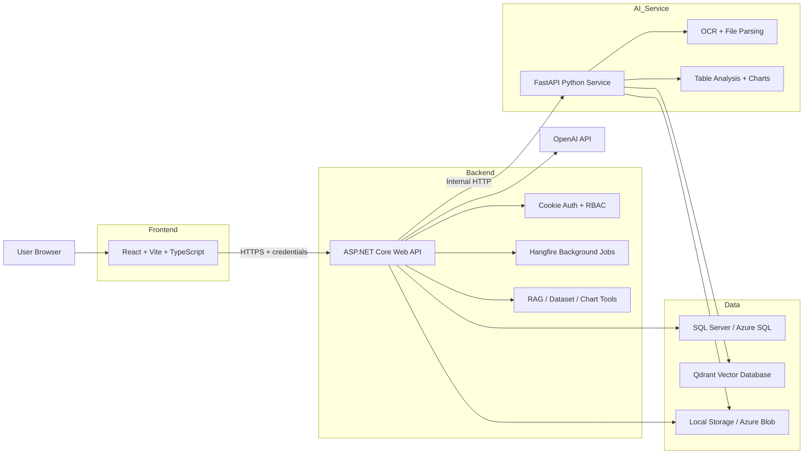
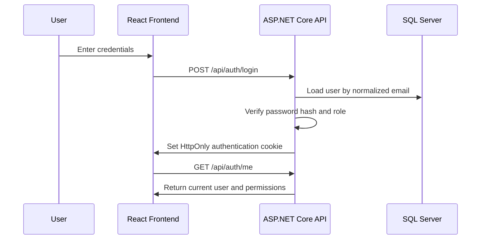
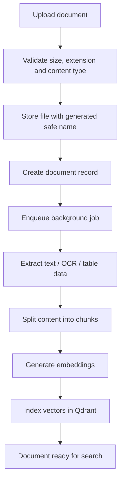
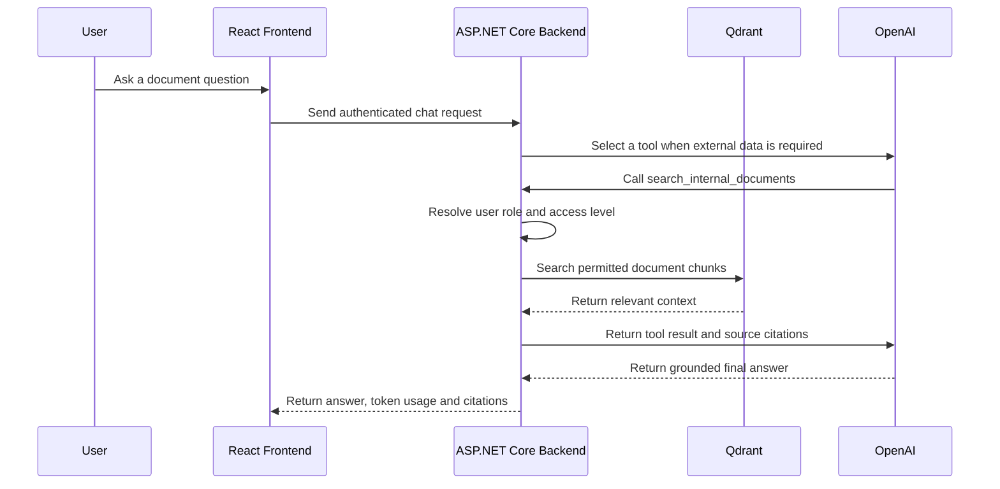
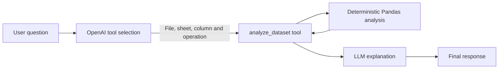

<div align="center">

# Internal AI Chatbot

### An end-to-end internal AI assistant for document intelligence, RAG-based question answering, spreadsheet analysis, and role-based access control

[](https://dotnet.microsoft.com/)
[](https://react.dev/)
[](https://fastapi.tiangolo.com/)
[](https://www.docker.com/)
[](https://azure.microsoft.com/)

**Live Demo:** https://purple-coast-0345b9800.7.azurestaticapps.net/login  
**Repository:** https://github.com/Nhb170405/Internal-AI-Chatbot

</div>

---

## Demo Access

The public demo intentionally provides a shared administrator account so reviewers and interviewers can explore the application without creating an account.

| Role | Email | Password |
|---|---|---|
| Admin | `admin@company.com` | `Admin@123` |
| Employee | `employee@company.com` | `Employee@123` |

> **Important:** These credentials are intentionally public for the demo environment only. They must not be reused in a real production deployment.

---

## Overview

Internal AI Chatbot is a full-stack AI application designed to help employees search, understand, and analyze internal company data.

Instead of treating every request as a generic prompt sent directly to an LLM, the system combines several specialized components:

- Retrieval-Augmented Generation for unstructured documents
- Dedicated tools for spreadsheet and table analysis
- OCR and document parsing through a Python service
- Role-based access control for internal data
- Background jobs for long-running document processing
- Token-aware request routing to reduce unnecessary LLM usage
- Cloud deployment across multiple Azure services

The project was built as an end-to-end learning and portfolio project. It covers the complete path from frontend interaction and backend business logic to AI orchestration, data storage, containerization, CI/CD, and cloud deployment.

---

## Why This Project Exists

Internal company knowledge is commonly spread across PDF reports, Word documents, Excel workbooks, CSV files, scanned documents, and operational tables.

Traditional file search can locate filenames, but it does not directly answer questions such as:

- What does this document say about a specific process?
- Which customers produced the highest revenue this month?
- What columns and sheets exist in this workbook?
- Can the system generate a chart from this dataset?
- Is the current user allowed to access the requested data?

This project turns those files into a permission-aware AI assistant capable of answering questions, retrieving relevant context, and delegating deterministic calculations to specialized tools.

---

## Key Features

### Authentication and Authorization

- Cookie-based authentication
- Guest, Employee, and Admin roles
- Role-based API authorization
- Guest session expiration
- Password hashing with ASP.NET Core `IPasswordHasher`
- Admin-only employee account creation
- Server-side claim validation
- Audit logging for authentication and sensitive actions

### AI Chat

- OpenAI-powered chat responses
- Tool-calling orchestration with a bounded multi-step loop
- Per-user conversation history stored in browser local storage
- Conversation titles generated from the user's first question
- Token usage tracking
- Input length validation
- Rate limiting
- Safe error handling when the AI provider is unavailable

### Retrieval-Augmented Generation

- Document ingestion
- Text extraction
- Document chunking
- Embedding generation
- Vector indexing with Qdrant
- Permission-aware semantic retrieval
- Relevant-context injection into LLM requests
- Source citations returned through both direct RAG and tool-calling flows
- Citation UI focused on source filename and page location when available
- Separation between deterministic tools and LLM reasoning

### Document Management

- Upload and process PDF, DOCX, XLSX, CSV, and TXT files
- Text-layer PDF parsing with OCR fallback for scanned PDFs
- File size limits
- Extension whitelist
- Content-Type validation
- Safe generated storage names
- Soft delete and restore
- Document status tracking
- Background processing with Hangfire
- Access levels for Guest, Employee, and Admin data

### Spreadsheet and Dataset Analysis

- Detect workbook sheets and columns
- Read structured table metadata without using LLM tokens
- Analyze complete CSV/XLSX dataframes through a dedicated Python service
- Deterministic `preview`, `list_columns`, `count`, `sum`, `average`, `group_by`, and `top_n` operations
- `analyze_dataset` tool for exact spreadsheet calculations from chat
- Generate charts from structured data
- Avoid sending entire large spreadsheets directly to the LLM
- Enforce document access permissions before a dataset tool can read a file

### Security Baseline

- HttpOnly authentication cookies
- Secure cookies in production
- Explicit CORS origin allowlist
- Role-based authorization
- Rate limiting for login, chat, and upload endpoints
- Safe global exception responses
- Security headers
- Upload path traversal protection
- Audit logs without storing passwords, tokens, or full sensitive prompts
- Internal-only communication between the ASP.NET Core backend and Python service

### Cloud Deployment

- React frontend on Azure Static Web Apps
- ASP.NET Core backend on Azure Container Apps
- Python FastAPI service in a separate container
- SQL Server / Azure SQL for relational data
- Azure Blob Storage-ready file storage
- Qdrant for vector search
- GitHub Actions for frontend deployment
- Docker Compose for local development

---

## System Architecture



### Architectural Responsibility

| Component | Responsibility |
|---|---|
| React frontend | UI, authentication state, chat experience, uploads, API calls |
| ASP.NET Core backend | Main API gateway, authorization, business rules, persistence, orchestration |
| Python FastAPI service | OCR, parsing, chunking support, dataset analysis, chart generation |
| SQL Server | Users, sessions, documents, chat history, audit logs, metadata |
| Qdrant | Embeddings and semantic vector retrieval |
| OpenAI API | Natural-language reasoning and answer generation |
| Hangfire | Long-running document-processing jobs |
| Azure Blob / local storage | Original documents and generated assets |

The frontend never calls the Python service directly. All client requests pass through the ASP.NET Core backend, where authentication and authorization are enforced.

---

## Main Workflows

### Authentication Flow



### Document Processing Pipeline



### RAG Question Flow



### Spreadsheet Tool Flow



Spreadsheet questions are delegated to deterministic Pandas operations instead of being calculated from RAG snippets or sample rows. The current tool supports CSV and XLSX files and returns structured results before the model produces a natural-language explanation.

---

## Technology Stack

| Area | Technology |
|---|---|
| Frontend | React, TypeScript, Vite, React Router |
| Backend | ASP.NET Core Web API, C#, Entity Framework Core |
| Authentication | ASP.NET Core Cookie Authentication, Claims, RBAC |
| Database | SQL Server / Azure SQL |
| AI Service | Python, FastAPI |
| AI Provider | OpenAI API |
| Vector Search | Qdrant |
| Background Jobs | Hangfire |
| File Processing | OCR, PDF/DOCX/XLSX/CSV/TXT parsing |
| Storage | Local volumes, Azure Blob Storage-ready |
| Containers | Docker, Docker Compose |
| Cloud | Azure Static Web Apps, Azure Container Apps |
| CI/CD | GitHub Actions |

---

## Repository Structure

```text
Internal-AI-Chatbot/
├── frontend/                 # React + Vite + TypeScript frontend
├── backend-dotnet/           # ASP.NET Core API
│   ├── Contracts/            # Request and response DTOs
│   ├── Infrastructure/       # Persistence, storage, OpenAI, Python clients, security
│   └── Modules/              # Auth, chat, documents, RAG, datasets, admin, jobs
├── ai-service-python/        # FastAPI AI and data-processing service
│   └── app/
│       ├── api/              # Ingestion, OCR, chunking, vector, dataset and chart routes
│       └── services/         # Parsing and analysis logic
├── docs/                     # Milestones, architecture notes and implementation history
├── .github/workflows/        # GitHub Actions workflows
├── docker-compose.yml        # Local multi-service environment
└── README.md
```

---

## Backend Design

The ASP.NET Core backend is the main security and orchestration boundary.

Typical request flow:

```text
Controller
  -> Application service
  -> EF Core / SQL Server
  -> OpenAI, Python, storage or vector integration
  -> Audit log
  -> Safe API response
```

Important design choices:

- Controllers remain focused on HTTP mapping.
- Services contain application and business logic.
- External integrations are placed under `Infrastructure`.
- API contracts are separated from database entities.
- Long-running document operations are delegated to background jobs.
- The backend validates authorization even when the frontend hides restricted UI.

---

## Authentication and Roles

| Role | Main permissions |
|---|---|
| Guest | Temporary session, chat, access to Guest-level documents |
| Employee | Internal login, upload documents, access Employee and Guest data |
| Admin | Full document access, user administration, system management |

The backend does not trust role values sent by the frontend. User identity and role are loaded from server-side data and stored in authenticated claims.

---

## Security Design

Implemented protections include:

- Password hashing
- HttpOnly cookies
- Secure production cookie policy
- Explicit CORS allowlist
- Server-side authorization
- Generic login failure messages
- Rate limiting
- File size and type validation
- Safe server-generated filenames
- Global exception middleware
- Security response headers
- Audit logging
- Environment-variable-based secrets
- Internal-only Python service access

### Known Security Limitations

This repository represents an MVP and portfolio project, not a fully audited enterprise product.

Before storing sensitive production data, the following improvements should be considered:

- Stronger CSRF protection for state-changing cookie-authenticated requests
- Magic-byte and archive-content inspection for uploaded files
- Malware scanning for document uploads
- Fine-grained department or resource ownership permissions
- Secret rotation and centralized secret management
- Automated security and dependency scanning
- Expanded automated authorization tests
- Production monitoring and alerting

---

## Token-Efficiency Strategy

The application avoids sending every request and every data source directly to the LLM.

Current routing principles:

- Normal conversation uses a short prompt and limited history.
- RAG requests retrieve only relevant chunks.
- Spreadsheet schema questions use stored metadata.
- Exact spreadsheet calculations are handled by the `analyze_dataset` tool over the complete dataframe.
- Large files are parsed before LLM involvement.
- Chat token usage is recorded for analysis.

Observed usage during MVP testing:

- Simple conversation: typically a few hundred tokens
- Short RAG requests: approximately 1,000 tokens
- Longer RAG requests: approximately 2,000–3,000 tokens
- Selected table metadata questions: no LLM call required

These are project observations, not guaranteed production benchmarks.

---

## Quick Start with Docker Compose

### Prerequisites

- Docker Desktop or Docker Engine
- Docker Compose
- OpenAI API key

### 1. Clone the repository

```bash
git clone https://github.com/Nhb170405/Internal-AI-Chatbot.git
cd Internal-AI-Chatbot
```

### 2. Create the root environment file

Create a `.env` file based on the variables required by `docker-compose.yml`.

```env
MSSQL_SA_PASSWORD=CHANGE_ME_WITH_A_STRONG_PASSWORD
OPENAI_API_KEY=YOUR_OPENAI_API_KEY
QDRANT_COLLECTION=internal_documents
```

Never commit the real `.env` file.

The bundled local Qdrant container does not require an API key. `QDRANT_API_KEY` may remain empty locally. A hosted Qdrant deployment should provide its real API key through cloud secrets.

### 3. Start the application

```bash
docker compose up --build
```

Typical local endpoints:

| Service | Address |
|---|---|
| Frontend | http://localhost:5173 |
| ASP.NET Core backend | http://localhost:5055 |
| Python service | http://localhost:8000 |
| Qdrant | http://localhost:6333 |
| SQL Server | localhost:14333 |

### 4. Stop the application

```bash
docker compose down
```

To remove local volumes as well:

```bash
docker compose down -v
```

> Removing volumes deletes locally stored database, vector, and uploaded-file data.

---

## Run Services Separately

### Frontend

```bash
cd frontend
npm install
npm run dev
```

Create `frontend/.env.local` when running outside Docker:

```env
VITE_API_BASE_URL=http://localhost:5055
```

### ASP.NET Core Backend

```bash
cd backend-dotnet
dotnet restore
dotnet run
```

### Python Service

```bash
cd ai-service-python
python -m venv .venv
```

Windows PowerShell:

```powershell
.venv\Scripts\Activate.ps1
pip install -r requirements.txt
uvicorn main:app --reload --port 8000
```

Linux/macOS:

```bash
source .venv/bin/activate
pip install -r requirements.txt
uvicorn main:app --reload --port 8000
```

---

## Important Configuration

### Backend environment variables

```text
ASPNETCORE_ENVIRONMENT
ConnectionStrings__DefaultConnection
OpenAI__ApiKey
OpenAI__BaseUrl
OpenAI__ChatModel
PythonService__BaseUrl
PythonService__TimeoutSeconds
Qdrant__Url
Qdrant__ApiKey
Qdrant__Collection
FileStorage__Provider
AzureBlobStorage__ConnectionString
Cors__AllowedOrigins__0
Database__AutoMigrate
Assistant__ToolCallingEnabled
```

### Frontend environment variables

```text
VITE_API_BASE_URL
```

Vite injects frontend environment variables at build time. Production values must therefore be configured in the GitHub Actions or Azure Static Web Apps build environment.

---

## Azure Deployment

The current public demo uses:

| Component | Azure service |
|---|---|
| Frontend | Azure Static Web Apps |
| Backend | Azure Container Apps |
| Python service | Azure Container Apps |
| Relational database | Azure SQL / SQL Server deployment |
| File storage | Azure Blob Storage-ready |
| CI/CD | GitHub Actions |

The Python service is designed as an internal backend dependency and is not called directly from the browser.

Production secrets are supplied through cloud environment variables and are excluded from Git.

---

## Screenshots

Add screenshots to a folder such as `docs/images/` and replace the placeholders below.

Suggested screenshots:

1. Login page
2. Chat interface
3. Document upload and processing status
4. Document search result
5. Spreadsheet analysis
6. Generated chart
7. Admin user management
8. Azure deployment overview

Example Markdown after adding an image:

```md

```

---

## Engineering Decisions

### Why ASP.NET Core and Python?

ASP.NET Core handles authentication, authorization, persistence, API design, and business orchestration. Python is used for OCR, file parsing, data analysis, and charting, where the ecosystem is stronger.

### Why use tools instead of sending every table to the LLM?

Deterministic operations such as schema inspection, filtering, aggregation, and chart generation are more reliable and cheaper when handled by code. The LLM is used for interpretation and explanation rather than replacing normal computation.

### Why use SQL Server and Qdrant separately?

SQL Server stores durable relational application data. Qdrant stores vectors optimized for semantic similarity search. Each data store serves a distinct responsibility.

### Why cookie authentication?

The project is a browser-based application. HttpOnly authentication cookies keep credentials out of normal frontend JavaScript and integrate naturally with ASP.NET Core authentication and role-based authorization.

### Why background jobs?

OCR, parsing, chunking, and indexing can take longer than a normal HTTP request. Hangfire allows the API to return quickly while processing continues asynchronously.

---

## Current Project Status

The project has reached MVP status.

Implemented:

- [x] Authentication and guest sessions
- [x] Role-based authorization
- [x] Browser-local, per-user chat sessions and first-question titles
- [x] OpenAI integration
- [x] Document upload
- [x] File validation
- [x] OCR and document ingestion
- [x] Chunking and vector indexing
- [x] RAG document search
- [x] OpenAI tool calling for document search and dataset analysis
- [x] RAG citations preserved through tool-calling responses
- [x] Spreadsheet metadata and deterministic full-dataframe analysis
- [x] Chart generation
- [x] Background jobs
- [x] Audit logging
- [x] Admin employee account API
- [x] Docker Compose environment
- [x] Azure frontend and backend deployment

---

## Roadmap

- [ ] Add CSRF protection for state-changing requests
- [ ] Add AI response streaming
- [ ] Add live document-processing progress
- [ ] Add hybrid semantic and keyword search
- [ ] Store page-level metadata directly on every document chunk
- [ ] Add exhaustive document-scoped retrieval for complete-list questions
- [ ] Add spreadsheet filters, min/max/median, distinct counts, and multi-column grouping
- [ ] Expand automated unit and integration tests
- [ ] Add authorization and concurrency test suites
- [ ] Add upload malware scanning
- [ ] Add centralized monitoring and alerting
- [ ] Add backend and Python CI/CD pipelines
- [ ] Add department-level permissions
- [ ] Improve mobile responsiveness and accessibility

---

## What I Learned

This project began when I had very limited knowledge of C#, ASP.NET Core, and web application architecture.

By building the MVP, I learned and applied:

- C# and asynchronous programming
- ASP.NET Core controllers, middleware, and dependency injection
- Entity Framework Core and database migrations
- SQL Server data modeling
- Cookie authentication and claims-based authorization
- React and backend API integration
- Docker and multi-container networking
- FastAPI and C#–Python service communication
- Background processing with Hangfire
- File upload and validation
- OCR and document-processing pipelines
- RAG, embeddings, vector search, and prompt construction
- LLM token tracking and tool-based routing
- CORS and cross-domain cookie debugging
- GitHub Actions
- Azure Static Web Apps and Azure Container Apps
- Cloud environment variables, revisions, logging, and deployment troubleshooting

The most important lesson was learning how to turn an unclear idea into a working multi-service system, debug it across multiple layers, and deploy it for real users.

---

## Known Limitations

- The public demo uses shared credentials.
- The current project is not intended to store confidential company data.
- Automated testing is still limited compared with a production-grade backend.
- Fine-grained organization and department permissions are not complete.
- AI responses can still be affected by retrieval quality and model behavior.
- Semantic top-K retrieval may omit items when a complete list is spread across many chunks.
- Citation page numbers depend on available parser/chunk metadata and may be unavailable.
- CSV/XLSX analysis currently supports a fixed operation set and does not yet support arbitrary filters, joins, or cross-file analysis.
- Cross-site authentication cookies may be blocked by strict private-browsing or third-party-cookie settings because the demo frontend and API use different Azure domains.
- Azure services may incur costs after free quotas or credits are exhausted.
- The project should undergo a formal security review before production use.

---

## Author

**Bách Nguyễn Huy**

- GitHub: https://github.com/Nhb170405
- Project: https://github.com/Nhb170405/Internal-AI-Chatbot
- Live Demo: https://purple-coast-0345b9800.7.azurestaticapps.net/login

---

## Disclaimer

This repository is an educational and portfolio project. Demo data and public credentials must not be treated as secure production configuration.
