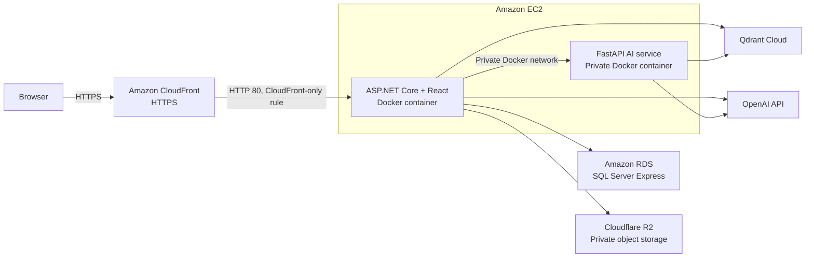

# Internal AI Chatbot

Internal AI Chatbot is a full-stack internal knowledge assistant for document
search, retrieval-augmented generation (RAG), OCR, spreadsheet analysis, chart
generation, and role-based access control.

[Live application](https://d3aafdspwgyxvd.cloudfront.net) ·
[AWS deployment guide](docs/deployment-aws-domainless.md) ·
[Vietnamese operator guide](docs/huong-dan-trien-khai-aws-khong-domain.md)

## Demo accounts

The live deployment is available for portfolio and recruitment evaluation.
Visitors can use guest access or sign in with either public demo account:

| Role | Email | Password |
| --- | --- | --- |
| Admin | `admin@company.com` | `Admin@123456` |
| Employee | `employee@company.com` | `Employee@123456` |

> These credentials are intentionally public and belong only to the demo
> environment. Do not reuse these passwords for AWS, Cloudflare, GitHub, email,
> or any other personal or production account.

## Current status

The MVP is deployed and running on the AWS/Cloudflare stack:

- HTTPS is provided by the default Amazon CloudFront domain.
- React and ASP.NET Core run together in one web container on EC2.
- FastAPI runs as a private container on the same EC2 instance.
- SQL Server Express runs privately on Amazon RDS.
- Documents and generated charts are stored in a private Cloudflare R2 bucket.
- Qdrant Cloud stores document embeddings.
- Docker Compose builds and restarts the production services.

## Architecture


```mermaid
flowchart LR
    Browser["Browser"]
    CF["Amazon CloudFront<br/>HTTPS"]

    subgraph EC2["Amazon EC2"]
        Web["ASP.NET Core + React<br/>Docker container"]
        Python["FastAPI AI service<br/>Private Docker container"]
    end

    RDS["Amazon RDS<br/>SQL Server Express"]
    R2["Cloudflare R2<br/>Private object storage"]
    Qdrant["Qdrant Cloud"]
    OpenAI["OpenAI API"]

    Browser -->|HTTPS| CF
    CF -->|HTTP 80, CloudFront-only rule| Web
    Web -->|Private Docker network| Python
    Web --> RDS
    Web --> R2
    Web --> Qdrant
    Web --> OpenAI
    Python --> Qdrant
    Python --> OpenAI
```

The Python service and RDS database are not exposed to the public Internet.
EC2 accepts web traffic only from the AWS-managed CloudFront origin-facing
prefix list. SSH access is restricted to the operator's IP address.

## Features

### Authentication and authorization

- Guest, Employee, and Admin roles
- Cookie authentication with secure, HttpOnly production cookies
- Server-side role authorization
- Admin UI for creating employee accounts
- Password hashing with ASP.NET Core Identity
- Guest session expiration
- Authentication and administrative audit logs

### Document intelligence and RAG

- PDF, DOCX, XLSX, CSV, and TXT upload
- Text extraction and OCR fallback for scanned PDFs
- Background ingestion with Hangfire
- Chunking, OpenAI embeddings, and Qdrant indexing
- Permission-aware semantic retrieval
- Source citations in chatbot answers
- Soft delete and restore

### Dataset analysis

- Workbook, sheet, and column discovery
- Deterministic Pandas operations over complete CSV/XLSX datasets
- Count, sum, average, grouping, preview, and top-N operations
- Chart generation with generated files stored in R2
- Tool-calling orchestration between the LLM and deterministic services

### Security baseline

- Same-origin frontend and API in production
- Rate limiting for login, chat, and upload routes
- File type, size, and path validation
- Security response headers
- Generic API error responses
- Internal API key between ASP.NET Core and FastAPI
- Environment-based secrets excluded from Git
- Private RDS, R2, and Python service connectivity

## Technology stack

| Area | Technology |
| --- | --- |
| Frontend | React, TypeScript, Vite, React Router |
| Backend | ASP.NET Core, C#, Entity Framework Core |
| AI/data service | Python, FastAPI, Pandas, OCR tooling |
| Database | SQL Server Express on Amazon RDS |
| Vector search | Qdrant Cloud |
| Object storage | Cloudflare R2 through its S3-compatible API |
| AI provider | OpenAI API |
| Background jobs | Hangfire |
| Runtime | Docker Engine and Docker Compose |
| Public delivery | Amazon CloudFront |
| Compute | Amazon EC2 |

## Repository layout

```text
Internal-AI-Chatbot/
├── frontend/                  React + Vite + TypeScript
├── backend-dotnet/            ASP.NET Core API and production web host
├── ai-service-python/         FastAPI ingestion and analysis service
├── docs/                      Architecture and deployment documentation
├── Dockerfile                Combined React + ASP.NET Core production image
├── docker-compose.yml        Local development stack
├── docker-compose.production.yml
└── .env.production.example   Production environment template
```

## Local development

### Requirements

- Docker Desktop or Docker Engine
- Docker Compose
- An OpenAI API key

Create a root `.env` file:

```dotenv
MSSQL_SA_PASSWORD=<strong-local-database-password>
OPENAI_API_KEY=<openai-api-key>
QDRANT_COLLECTION=internal_documents
```

Start the local stack:

```bash
docker compose up --build
```

Default local endpoints:

| Service | URL |
| --- | --- |
| React frontend | `http://localhost:5173` |
| ASP.NET Core API | `http://localhost:5055` |
| FastAPI service | `http://localhost:8000` |
| Qdrant | `http://localhost:6333` |
| SQL Server | `localhost:14333` |

Stop the stack:

```bash
docker compose down
```

Development no longer creates fixed demo users. Create users explicitly through
a local development utility or the production-style bootstrap described below.

## Production deployment

The production environment is configured through `.env.production`, which must
never be committed. Start it with:

```bash
docker compose --env-file .env.production \
  -f docker-compose.production.yml build

docker compose --env-file .env.production \
  -f docker-compose.production.yml up -d
```

### Create the first administrator

For the first production start only:

```dotenv
BOOTSTRAP_ADMIN_ENABLED=true
BOOTSTRAP_ADMIN_EMAIL=<private-admin-email>
BOOTSTRAP_ADMIN_PASSWORD=<unique-password-with-at-least-12-characters>
```

After the first successful admin login:

1. Set `BOOTSTRAP_ADMIN_ENABLED=false`.
2. Remove `BOOTSTRAP_ADMIN_EMAIL` and `BOOTSTRAP_ADMIN_PASSWORD`.
3. Recreate the web container so the plaintext bootstrap secret is removed from
   its environment.

The bootstrapper never creates a second administrator when one already exists.
Employees are created from `Admin → Users` and their passwords are stored only
as hashes.

### Update the EC2 deployment

```bash
cd ~/internal-ai-chatbot
git pull origin main

docker compose --env-file .env.production \
  -f docker-compose.production.yml build

docker compose --env-file .env.production \
  -f docker-compose.production.yml up -d
```

See [the full domainless AWS deployment guide](docs/deployment-aws-domainless.md)
for RDS, R2, EC2, CloudFront, firewall, and operational instructions.

## Required production configuration

The complete template is available in
[`.env.production.example`](.env.production.example). Main categories:

- OpenAI API key and model names
- Qdrant URL, API key, and collection
- FastAPI internal service key
- RDS SQL Server connection string
- R2 service URL, bucket, Access Key ID, and Secret Access Key
- Optional one-time administrator bootstrap values

Do not paste secrets into issues, pull requests, screenshots, terminal output,
or committed files.

## Validation

The deployment should be considered healthy only after verifying:

- CloudFront HTTPS loads while direct EC2 HTTP access is blocked
- Guest chat works
- Admin login works
- Admin can create an employee and the employee can log in
- Document upload stores an object in R2
- Background processing completes
- Qdrant retrieval returns relevant document citations
- Dataset analysis and chart generation complete successfully
- Containers return after an EC2 or Docker restart

## Known limitations

- This is an MVP and has not undergone a formal third-party security audit.
- CSRF protection for cookie-authenticated state changes should be strengthened.
- Password reset and self-service password change flows are not implemented yet.
- Department-level authorization is not complete.
- Malware scanning for uploads is not implemented.
- Monitoring, alerting, and automated integration tests should be expanded.
- AWS, OpenAI, R2, and Qdrant may incur charges beyond credits or free limits.

## Historical documentation

Some files under `docs/` describe earlier milestones and the previous Azure
deployment. They are retained as implementation history only. The active
production reference is `docs/deployment-aws-domainless.md`.

## Author

**Bách Nguyễn Huy**

- GitHub: [Nhb170405](https://github.com/Nhb170405)
- Repository: [Internal-AI-Chatbot](https://github.com/Nhb170405/Internal-AI-Chatbot)

## License and disclaimer

This repository is an educational and portfolio project. Do not use it for
confidential production data without additional security review, monitoring,
backup, and incident-response controls.
